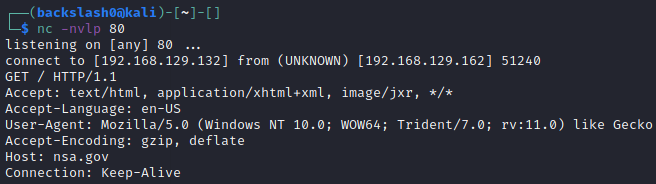
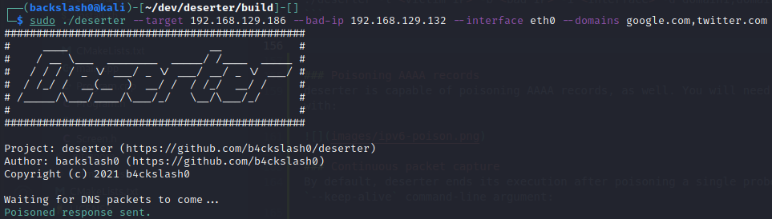
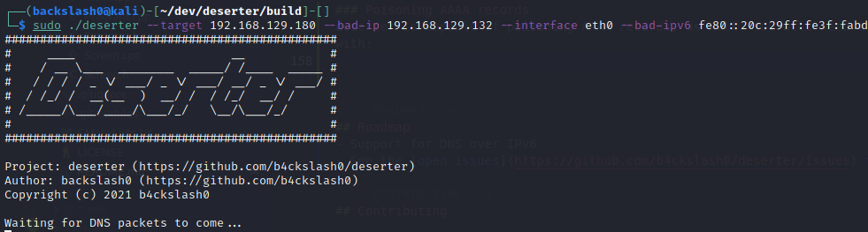
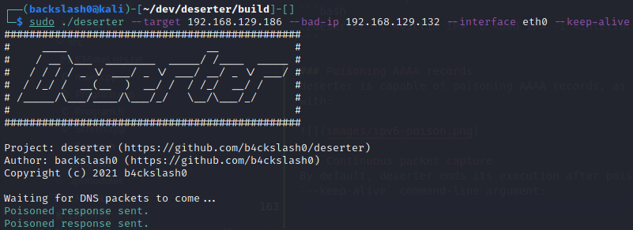

<!--
*** Thanks for checking out the Best-README-Template. If you have a suggestion
*** that would make this better, please fork the repo and create a pull request
*** or simply open an issue with the tag "enhancement".
*** Thanks again! Now go create something AMAZING! :D
***
***
***
*** To avoid retyping too much info. Do a search and replace for the following:
*** b4ckslash0, deserter, twitter_handle, email, deserter, A <i>targeted</i> DNS cache poisoner. 
*** Template provided by
Copyright (c) 2018 Othneil Drew
-->


<!-- PROJECT SHIELDS -->
<!--
*** I'm using markdown "reference style" links for readability.
*** Reference links are enclosed in brackets [ ] instead of parentheses ( ).
*** See the bottom of this document for the declaration of the reference variables
*** for contributors-url, forks-url, etc. This is an optional, concise syntax you may use.
*** https://www.markdownguide.org/basic-syntax/#reference-style-links
-->
[![Contributors][contributors-shield]][contributors-url]
[![Forks][forks-shield]][forks-url]
[![Stargazers][stars-shield]][stars-url]
[![Issues][issues-shield]][issues-url]
[![MIT License][license-shield]][license-url]

  <h3 align="center">deserter</h3>

  <p align="center">
	A <i>targeted</i> DNS cache poisoner.
    <br />
    <br />
    <a href="https://github.com/b4ckslash0/deserter/issues">Report Bug</a>
    ·
    <a href="https://github.com/b4ckslash0/deserter/issues">Request Feature</a>
  </p>
</p>


<!-- TABLE OF CONTENTS -->
<details open="open">
  <summary>Table of Contents</summary>
  <ol>
    <li>
      <a href="#about-the-project">About The Project</a>
    </li>
    <li>
      <a href="#getting-started">Getting Started</a>
      <ul>
		  <li><a href=#prerequisites>Prerequisites</a></li>
        	<li><a href="#installation">Installation</a></li>
		  	<li><a href="#Installation with support for multiple queries in a single request">Installation with support for multiple queries in a single request</a></li>
      </ul>
    </li>
    <li><a href="#usage">Usage</a></li>
    <li><a href="#roadmap">Roadmap</a></li>
    <li><a href="#contributing">Contributing</a></li>
    <li><a href="#license">License</a></li>
    <li><a href="#contact">Contact</a></li>
  </ol>
</details>


<!-- ABOUT THE PROJECT -->
## About The Project

<!---[![Product Name Screen Shot][product-screenshot]](https://example.com)-->

`deserter` is a *targeted* DNS cache poisoner. It is capable of DNS cache poisoning *without* bruteforcing the target ID and source port - instead, it sniffs out DNS probes and uses the information inside to craft poisoned responses and send them back to the target.

<!-- GETTING STARTED -->
## Getting Started

To get a local copy up and running follow these simple steps.

### Prerequisites

In order for the tool to work, the attacker needs to be on the same network as the victim. Sometimes, *arp spoofing* may also be required - usually on physical connections through Ethernet.

### Installation

1. Clone the repo with its submodule 
```bash
git clone --recurse-submodules https://github.com/b4ckslash0/deserter
```

2. Change into `deserter/scripts`
```bash
cd deserter/scripts
```

3. Change the permissions for the installation script and run it
```bash
chmod +x install.sh
```
```bash
./install.sh
```

### Installation with support for multiple queries in a single request
1. Clone the repo with its submodule 
```bash
git clone --recurse-submodules https://github.com/b4ckslash0/deserter
```

2. Change into `deserter/scripts`
```bash
cd deserter/scripts
```

3. Change the permissions for the installation script and run it with the `SUPPORT_MULTIPLE_QUERIES_IN_A_SINGLE_REQUEST` option
```bash
chmod +x install.sh
```
```bash
./install.sh SUPPORT_MULTIPLE_QUERIES_IN_A_SINGLE_REQUEST
```

<!-- USAGE EXAMPLES -->
## Usage

The tool requires sudo permissions to be run.
You can run deserter with `--help` to get information about all of the available options. Three of them are required:
- `-t` - the IPv4 address of the victim
- `-b` - the IPv4 address to poison resource records with
- `-i` - the interface to use (IP address or a name)

### Performing a DNS cache poisoning
The following syntax can be used for a simple DNS cache poisoning attack:
```bash
./deserter -t <victim IP> -b <bad IP> -i <interface>
```
or
```bash
./deserter --target <victim IP> --bad_ip <bad IP> --interface <interface>
```


We are successful:



### Specifying domains to poison
It is also possible to specify which domains you want deserter to poison by using the --domains or -d options and then specifying a list of domains separated by commas without spaces:
```bash
./deserter -t <victim IP> -b <bad IP> -i <interface> -d domain1,domain2,domain3,...
```



### Poisoning AAAA records
deserter is capable of poisoning AAAA records, as well. You will need to specify the `--bad-ipv6` option followed by the IPv6 address you want to poison the cache with:



### Continuous packet capture
By default, deserter ends its execution after poisoning a single probe. You can tell it to continue waiting for packets and poisoning them by specifying the `--keep-alive` command-line argument:




<!-- ROADMAP -->
## Roadmap
- Support for DNS over IPv6
- See the [open issues](https://github.com/b4ckslash0/deserter/issues) for a list of proposed features (and known issues).

<!-- CONTRIBUTING -->
## Contributing

Contributions are what make the open source community such an amazing place to learn, inspire, and create. Any contributions you make are **greatly appreciated**.

1. Fork the Project
2. Create your Feature Branch (`git checkout -b feature/AmazingFeature`)
3. Commit your Changes (`git commit -m 'Add some AmazingFeature'`)
4. Push to the Branch (`git push origin feature/AmazingFeature`)
5. Open a Pull Request


<!-- LICENSE -->
## License

Distributed under the MIT License. See `LICENSE` for more information.


<!-- CONTACT -->
## Contact

Project Link: [https://github.com/b4ckslash0/deserter](https://github.com/b4ckslash0/deserter)


<!-- ACKNOWLEDGEMENTS -->


<!-- MARKDOWN LINKS & IMAGES -->
<!-- https://www.markdownguide.org/basic-syntax/#reference-style-links -->
[contributors-shield]: https://img.shields.io/github/contributors/b4ckslash0/deserter.svg?style=for-the-badge
[contributors-url]: https://github.com/b4ckslash0/deserter/graphs/contributors
[forks-shield]: https://img.shields.io/github/forks/b4ckslash0/deserter.svg?style=for-the-badge
[forks-url]: https://github.com/b4ckslash0/deserter/network/members
[stars-shield]: https://img.shields.io/github/stars/b4ckslash0/deserter.svg?style=for-the-badge
[stars-url]: https://github.com/b4ckslash0/deserter/stargazers
[issues-shield]: https://img.shields.io/github/issues/b4ckslash0/deserter.svg?style=for-the-badge
[issues-url]: https://github.com/b4ckslash0/deserter/issues
[license-shield]: https://img.shields.io/github/license/b4ckslash0/deserter.svg?style=for-the-badge
[license-url]: https://github.com/b4ckslash0/deserter/blob/master/LICENSE.txt