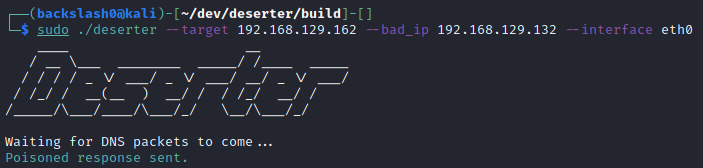
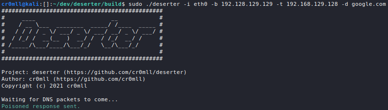
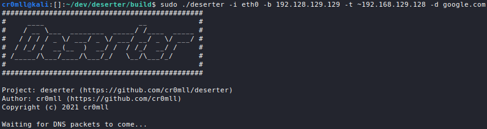

<!--
*** Thanks for checking out the Best-README-Template. If you have a suggestion
*** that would make this better, please fork the repo and create a pull request
*** or simply open an issue with the tag "enhancement".
*** Thanks again! Now go create something AMAZING! :D
***
***
***
*** To avoid retyping too much info. Do a search and replace for the following: 
*** Template provided by
Copyright (c) 2018 Othneil Drew
-->


<!-- PROJECT SHIELDS -->
<!--
*** I'm using markdown "reference style" links for readability.
*** Reference links are enclosed in brackets [ ] instead of parentheses ( ).
*** See the bottom of this document for the declaration of the reference variables
*** for contributors-url, forks-url, etc. This is an optional, concise syntax you may use.
*** https://www.markdownguide.org/basic-syntax/#reference-style-links
-->
[![Contributors][contributors-shield]][contributors-url]
[![Forks][forks-shield]][forks-url]
[![Stargazers][stars-shield]][stars-url]
[![Issues][issues-shield]][issues-url]
[![MIT License][license-shield]][license-url]

  <h3 align="center">deserter</h3>

  <p align="center">
	A <i>targeted</i> DNS cache poisoner.
    <br />
    <br />
    <a href="https://github.com/cr0mll/deserter/issues">Report Bug</a>
    ·
    <a href="https://github.com/cr0mll/deserter/issues">Request Feature</a>
  </p>
</p>


<!-- TABLE OF CONTENTS -->
<details open="open">
  <summary>Table of Contents</summary>
  <ol>
    <li>
      <a href="#about-the-project">About The Project</a>
	    <ul>
		    <li><a href=#highlights>Highlights</a></li>
	    </ul>
    </li>
    <li>
      <a href="#getting-started">Getting Started</a>
      <ul>
		  <li><a href=#prerequisites>Prerequisites</a></li>
        	<li><a href="#installation">Installation</a></li>
		  	<li><a href="#Installation with support for multiple queries in a single request">Installation with support for multiple queries in a single request</a></li>
      </ul>
    </li>
    <li><a href="#usage">Usage</a></li>
    <li><a href="#roadmap">Roadmap</a></li>
    <li><a href="#contributing">Contributing</a></li>
    <li><a href="#license">License</a></li>
    <li><a href="#contact">Contact</a></li>
  </ol>
</details>


<!-- ABOUT THE PROJECT -->
## About The Project

<!---[![Product Name Screen Shot][product-screenshot]](https://example.com)-->

`deserter` is a *targeted* DNS cache poisoner. It is capable of DNS cache poisoning *without* bruteforcing the target ID and source port - instead, it sniffs out DNS probes and uses the information inside to craft poisoned responses and send them back to the target.

In the absence of DNS security mechanisms, `deserter` has a near 100% success rate of poisoning the target's cache when the router has to forward the DNS query to an external DNS server (the router doesn't have an entry for the domain in its own cache).

### Highlights
- Silence - `deserter` doesn't flood the network with any type of packet - it only ever sends a single response per query received.
- Speed - `deserter` is fast which is required when racing against packets coming from the legitimate name server.
- Robustness & Easy of Use - `deserter` supports DNS/MDNS queries of type A/AAAA as well as DNS over IPv6, all while being extremely simple to use.

<!-- GETTING STARTED -->
## Getting Started

To get a local copy up and running follow these simple steps.

### Prerequisites

In order for the tool to work, the attacker needs to be on the same network as the victim. Sometimes, *arp spoofing* may also be required - usually on physical connections through Ethernet.

### Building from source

1. Clone the repo with its submodules 
```bash
git clone --recurse-submodules https://github.com/cr0mll/deserter
```

2. Install libpcap
```bash
sudo apt-get install libpcap-dev
```

3. Change into `deserter/scripts`
```bash
cd deserter/scripts
```

4. Change the permissions for the scripts and run it
```bash
chmod +x *
```
Run the installation script:
```bash
./install.sh
```

This will configure and build the binary in the `deserter/build` directory.

You can use the scripts `configure.sh` and `build.sh` to manually configure and build the cmake project.

<!-- USAGE EXAMPLES -->
## Usage

The tool requires sudo permissions to be run.
You can run deserter with `--help` to get information about all of the available options. 


### Performing a DNS cache poisoning
For any DNS cache poisoning attack, you will need to specify the network interface which `deserter` should use and the IPv4 address which to use for poisoning queries:
```bash
./deserter -b <bad IP> -i <interface>
```



#### Specifying targets to poison
The `-t`/`--targets` options can be used to provide a comma-separated list, without whitespace, of IPv4/IPv6 addresses whose queries to poison. By default, `deserter` will poison all queries it sees. Furthermore, you can prepend `~` to any IP addresses you want to *exclude* from the target list, such that their queries are left unaltered.

#### Specifying domains to poison
The `-d`/`--domains` options can be used to provide comma-separated list, without whitespace, of the domains which to poison when they are found in a query. By default, `deserter` will poison all domains.





<!-- ROADMAP -->
## Roadmap
- See the [open issues](https://github.com/cr0mll/deserter/issues) for a list of proposed features (and known issues).

<!-- CONTRIBUTING -->
## Contributing

Contributions are what make the open source community such an amazing place to learn, inspire, and create. Any contributions you make are **greatly appreciated**.

1. Fork the Project
2. Create your Feature Branch (`git checkout -b feature/AmazingFeature`)
3. Commit your Changes (`git commit -m 'Add some AmazingFeature'`)
4. Push to the Branch (`git push origin feature/AmazingFeature`)
5. Open a Pull Request


<!-- LICENSE -->
## License

Distributed under the MIT License. See `LICENSE` for more information.

<!-- CONTACT -->
## Contact

Project Link: [https://github.com/cr0mll/deserter](https://github.com/cr0mll/deserter)


<!-- ACKNOWLEDGEMENTS -->


<!-- MARKDOWN LINKS & IMAGES -->
<!-- https://www.markdownguide.org/basic-syntax/#reference-style-links -->
[contributors-shield]: https://img.shields.io/github/contributors/b4ckslash0/deserter.svg?style=for-the-badge
[contributors-url]: https://github.com/cr0mll/deserter/graphs/contributors
[forks-shield]: https://img.shields.io/github/forks/cr0mll/deserter.svg?style=for-the-badge
[forks-url]: https://github.com/cr0mll/deserter/network/members
[stars-shield]: https://img.shields.io/github/stars/cr0mll/deserter.svg?style=for-the-badge
[stars-url]: https://github.com/cr0mll/deserter/stargazers
[issues-shield]: https://img.shields.io/github/issues/cr0mll/deserter.svg?style=for-the-badge
[issues-url]: https://github.com/cr0mll/deserter/issues
[license-shield]: https://img.shields.io/github/license/cr0mll/deserter.svg?style=for-the-badge
[license-url]: https://github.com/cr0mll/deserter/blob/master/LICENSE.txt
